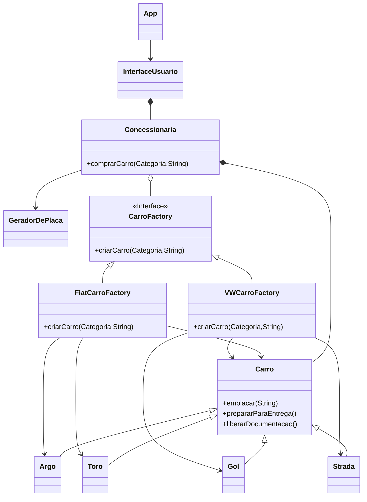

# Concessionária Multimarcas

Este projeto é utilizado em exercícios sobre Padrões de Projeto em disciplinas de Programação Orientada a Objetos.

## Passo 1

Este projeto representa uma concessionária de forma bem simplificada, pois a intenção é facilitar a resolução dos exercícios.
Mas, especialmente **para as perguntas reflexivas** abaixo, **considere como as classes seriam em um sistema completo, bem mais complexas e extensas, e responda pensando nisso**.

Execute o programa implementado neste projeto e teste todas as suas opções.

Estude o projeto e veja que ele possui uma superclasse chamada `Carro` e subclasses para cada modelo de carro.
Ele também possui uma classe `Concessionaria`, que é a principal classe de regra de negócio do sistema, e que
permite que o usuário compre um carro.

Em seguida, mude a marca da franquia da `Concessionaria`, alterando a chamada do seu construtor, e teste o programa novamente.

## Passo 2

No passo anterior, vimos que a classe `Concessionaria` não tem os carros de todas as categorias para a Marca VW.

Faça as alterações necessárias para que a classe `Concessionaria` consiga entregar modelos de Saveiro (Pickup da VW).
Por enquanto não trate os carros de luxo.

O que você achou das mudanças no código? Lembrando que você deve considerar um sistema completo, no qual a classe `Concessionaria` seria a principal classe de regra de negócio do sistema, e, portanto, seria bem mais complexa.

> As mudanças de código alteraram a classe Concessionaria. Também foi criado uma nova classe para representar o modelo Saveiro da marca VW. Seguindo o princípio de que uma classe é aberta para extensão e fechada para modificação, as mudanças que foram realizadas não são boas para um bom design de classes.

O que aconteceria se o carro popular da VW passasse a ser o UP!
Que partes do código precisariam ser alteradas?

> Seria necessário criar uma nova classe para o carro UP que herda da classe Carro e alterar a estrutura condicional do método comprarCarro da classe Concessionaria.

O que aconteceria se quiséssemos agora comprar carros da Chevrolet?
Que partes do código precisariam ser alteradas?

> O método comprarCarro deveria ser alterado novamente adicionando novas estruturas condicionais para tratar os casos dos carros de marca Chevrolet. Além disso, também seria necessário alterar a classe enum Marca adicionando a nova marca Chevrolet.

## Passo 3

Veja que no passo anterior, nós acabamos mudando o código da classe `Concessionaria` para produzir carros diferentes.
Isso está acontecendo porque nossa classe está dependendo de classes concretas (ou seja, depende da criação de objetos de tipos específicos).

Seguindo os _Princípios de Design_ que aprendemos, o ideal é que nossas classes sejam _abertas para extensão e fechadas para modificação_.
Se nós quiséssemos tratar uma nova marca (Chevrolet, por exemplo) teríamos que fazer ainda mais modificações na classe `Concessionaria`.

Na aula teórica vimos que o **Padrão de Projeto Abstract Factory** é muito útil nessas situações.
Com ele, nós poderemos criar carros de tipos diferentes, inclusive de marcas diferentes, sem precisarmos alterar o código da classe `Concessionaria` a cada novo modelo de carro.

Faça então um diagrama de classes UML das alterações necessárias para implementar o Padrão de Projeto Abstract Factory, considerando duas fábricas concretas: VW e Fiat.

#### Dicas sobre o Diagrama de Classes UML

No diagrama, preocupe-se em representar apenas uma visão geral das classes e dos métodos principais necessários para demonstrar a aplicação do padrão de projeto solicitado.

Para fazer o diagrama você pode optar por usar:

- um software qualquer (como o `Dia`).
- ou um algum editor online como o https://www.diagrameditor.com/
- ou ainda usar o `Mermaid` que permite fazer o diagrama aqui mesmo, diretamente no arquivo README do projeto.

Caso use um software ou um editor online, exporte a modelagem para uma imagem no formato `png` e coloque o arquivo em uma pasta `doc` dentro da pasta principal do projeto.

Já o `Mermaid` é interessante pois o GitHub possui uma integração com ele que permite exibir um diagrama de classes UML em um arquivo Markdown, como este arquivo README.
Para isso, basta "escrever" o diagrama de classes usando a [sintaxe](https://mermaid.js.org/syntax/classDiagram.html) do `Mermaid`, como no exemplo abaixo (que é um diagrama *incompleto* do projeto).

> Obs.: Para que você consiga visualizar o Diagrama de Classes dentro do VS Code, instale a extensão `Markdown Preview Mermaid Support` e acesse a visualização do arquivo README.md (atalho Ctrl+Shift+V).

## Passo 4

Faça a implementação de acordo com a modelagem do exercício anterior.
Crie as classes necessárias para tratar as marcas VW e Fiat.
Teste suas alterações.

O que aconteceria agora se o carro popular da VW passasse a ser o UP!
A classe Concessionaria precisaria ser alterada?

> Com a implementação do padrão de projeto Abstract Factory agora não ocorre mais alterações na classe Concessionaria quando é necessário alterar códigos relacionados com a criação de carros. Com isso, o princípio de manter uma classe aberta para extensão e fechada para modificação é respeitado.

O que aconteceria agora se quiséssemos agora comprar carros da Chevrolet?
Quais partes do código precisariam ser alteradas?

> Seria necessário criar uma nova classe referente a marca Chevrolet que, por exemplo, ChevroletCarroFactory que implementa os métodos da interface CarroFactory. E então passar essa nova factory como parâmetro da classe Concessionaria. Também seria necessário alterar a classe Marca para adicionar a marca Chevrolet.

## Passo 5

Faça agora as alterações necessárias para que nossa concessionária possa vender carros da Chevrolet.

Quais mudanças foram necessárias na classe `Concessionaria`?

> Não foram realizadas alterações na classe Concessionaria.

## Passo 6

Veja que com a utilização do Padrão de Projeto Abstract Factory nós ganhamos a possibilidade de até mudarmos a marca da franquia _em tempo de execução_, caso necessário.

Crie então na classe `Concessionaria` a opção de mudar a marca da franquia e faça os tratamentos necessários.

Adicione uma opção de menu _Mudar Franquia_ na interface do usuário, que permite que ele mude a franquia da concessionária.
Teste seu programa comprando carros de uma franquia, e depois mude a franquia e compre novos carros.

O que achou das alterações? Tente comparar como isso seria feito com o código inicial do Passo 1.

> As alterações que foram feitas não alteraram significativamente a classe Concessionaria, na verdade, ela apenas foi extendida adicionando um método para alterar o seu atributo factory e não houve modificações de métodos anteriomente escritos. A alteração da marca da franquia fosse feita com o código inicial possívelmente teria que modificar a classe Concessionaria.
